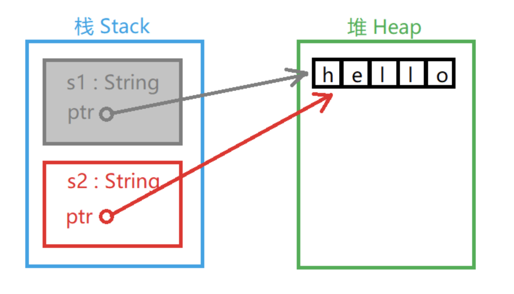
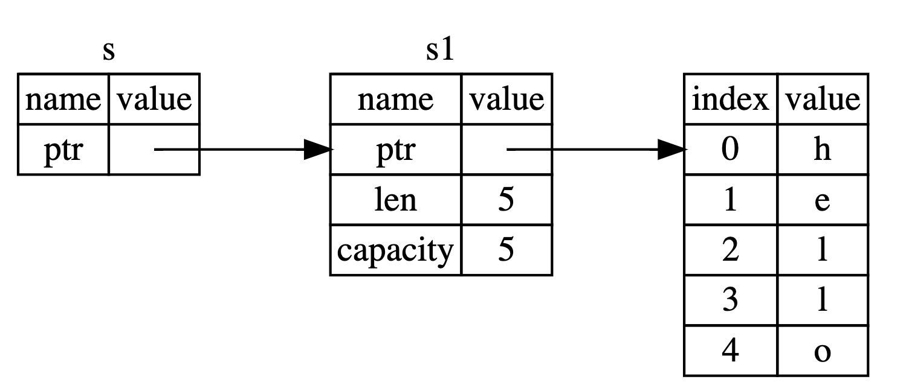

# 基础知识

## 输出到命令行
### 输出字符串
Rust 输出文字的方式主要有两种：
1. `println!()`
2. `print!()`

区别在于:
- `println!`在输出的最后附加输出一个换行符
- `println` 允许打印空的字符串到新的一行，`print!`不允许 

### println!
```rs
fn main(){
    println!(); // prints just a newline
    println!("hello there!");
    println!("My name is {}", 'json');
    println!("format {{}}");
    // There are various optional patterns this works with. Positional
    // arguments can be used.
    println!("{0}, this is {1}. {1}, this is {0}", "Alice", "Bob");
    // As can named arguments.
    println!("{subject} {verb} {object}",
             object="the lazy dog",
             subject="the quick brown fox",
             verb="jumps over");
}
```
总结：
- 使用 `{}` 作占位符
- 可以使用`{number}`指定变量位置
- 使用`{{}}`转义显示字符串`{}`

### format
类似 JS 中的模版字符串
```rs
    let s1 = String::from("tic");
    let s2 = String::from("tac");
    let s3 = String::from("toe");

    //将 s 设置为 “tic-tac-toe”
    let s = format!("{}-{}-{}", s1, s2, s3); //
```
宏 format! 生成的代码:
- 使用索引
- 不会获取任何参数的所有权。

## 函数定义
``` rs
fn main() {
    let result = another_function(5, 6);
    println!("x + y = {}", result)
}

// 带有返回值的函数
fn another_function(x: i32, y: i32) -> i32 {
    println!("x 的值为 : {}", x);
    println!("y 的值为 : {}", y);
    return x + y;
}
```
总结：
-  Rust不在乎您在何处定义函数，只需在某个地方定义它们即可
-  Rust 是强类型语言，函数参数和函数返回值需要指定类型

不同之处一：
```rs
fn main() {
    let x = (let y = 6);
}
```
`let y = 6` 语句并不返回值，所以没有可以绑定到 `x` 上的值。这与其他语言不同，例如 `C` 和 `Ruby`，它们的赋值语句会返回所赋的值。在这些语言中，可以这么写 `x = y = 6`，这样 x 和 `y` 的值都是 `6`；`Rust` 中不能这样写。

不同之处二
```rs
    let y = { // 代码块表达式
        let x = 3;
        x + 1  // 这里没有";",表示这里是返回值
    };

    println!("The value of y is: {}", y);
```
表达式的结尾没有分号。如果在表达式的结尾加上分号，它就变成了语句，而语句不会返回值。

## 定义变量
### 声明变量
如果要声明变量，需要使用 `let` 关键字。例如：
```rs
let a = 123;
```
这样就声明了 `a` 是一个**不可变变量**。在这句声明语句之后，以下三行代码都是被禁止的：
```
a = "abc";
a = 4.56; 
a = 456;
```
- 第一行的错误在于当声明 a 是 123 以后，a 就被确定为整型数字，不能把字符串类型的值赋给它
- 第二行的错误在于自动转换数字精度有损失，Rust 语言不允许精度有损失的自动数据类型转换
- 第三行的错误在于 a 不是个可变变量

### 使变量变得"可变"
使变量变得"可变"（mutable）只需一个 `mut` 关键字：
```rs
let mut a = 123;
a = 456;
```
### 常量与不可变变量的区别
既然不可变变量是不可变的，那不就是常量吗？为什么叫变量？</br>
变量和常量还是有区别的。在 Rust 中，以下程序是合法的：
```rs
let a = 123;   // 可以编译，但可能有警告，因为该变量没有被使用
let a = 456;
```
但是如果 a 是常量就不合法：
```rs
const a: i32 = 123;
let a = 456;
```
变量的值可以"重新绑定"，但在"重新绑定"以前不能私自被改变，这样可以确保在每一次"绑定"之后的区域里编译器可以充分的推理程序逻辑。

### 隐藏(shadowing)
隐藏就是指变量的名称可以被重新使用的机制。隐藏与可变变量的赋值不是一个概念，隐藏是指用同一个名字重新代表另一个变量实体，其类型、可变属性和值都可以变化。但可变变量赋值仅能发生值的变化。例如：
```rs
fn main() {
    {
        println!("before being shadowed: {}", shadowed_binding);
        // This binding *shadows* the outer one
        let shadowed_binding = "abc";
        println!("shadowed in inner block: {}", shadowed_binding);
    }
    println!("outside inner block: {}", shadowed_binding);
    // This binding *shadows* the previous binding
    let shadowed_binding = 2;
    println!("shadowed in outer block: {}", shadowed_binding);
}
```
输出：
```bash
shadowed in inner block: abc
shadowed in outer block: 2
```
下面这段程序会出错：不能给字符串变量赋整型值。
```rs
let mut s = "123";
s = s.len();
```

### reference
`shadowing`会发生多次拷贝。
`&` 表示这个参数是一个 引用（reference），它允许多处代码访问同一处数据，而无需在内存中多次拷贝。

## Rust 数据类型
### 标量
标量（scalar）*类型代表一个单独的值*。Rust 有四种基本的标量类型：整型、浮点型、布尔类型和字符类型。
#### 整数
##### 字节长度
| 长度 | 有符号 | 无符号 |
|-----|-------|--------|
|  8-bit | `i8` | `u8` |
|  16-bit | `i16` | `u16` |
|  32-bit | `i32` | `u32` |
|  128-bit | `i128` | `u128` |
|  arch | `isize` | `usize` |
注：isize 和 usize 类型依赖运行程序的计算机架构：64 位架构上它们是 64 位的， 32 位架构上它们是 32 位的。

每一个有符号的变体可以储存包含从 -(2^n - 1) 到 2^(n - 1) - 1 在内的数字；无符号的变体可以储存从 0 到 2^n - 1 的数字

##### 进制
| 数字字面值 |	例子 |
|----------|-------|
| Decimal (十进制) | 98_222 |
| Hex (十六进制) |	0xff |
| Octal (八进制) |	0o77 |
| Binary (二进制) |	0b1111_0000 |

那么该使用哪种类型的数字呢？如果拿不定主意，Rust 的默认类型通常是个不错的起点，数字类型默认是 i32。isize 或 usize 主要作为某些集合的索引。
#### 浮点数
支持 32 位浮点数（f32）和 64 位浮点数（f64），默认情况下，64.0 将表示 64 位浮点数。

#### 布尔类型
true/false

#### 字符类型
字符型用 char 表示。Rust的 char 类型大小为 4 个字节，代表 Unicode标量值，它可以支持中文，日文和韩文字符等非英文字符甚至表情符号和零宽度空格。
字符串使用 `String` 表示。
在 Rust 中字符串和字符都必须使用 UTF-8 编码，否则编译器会报错。


#### 字符串
> 符串并不简单。

调用 `chars` 方法会将 `hello` 分开并返回 `5` 个 `char` 类型的值，接着就可以遍历其结果来访问每一个元素了：
```rs
for c in "hello".chars() {
    println!("{}", c);
}
```
另外 bytes 方法返回每一个原始字节，这可能会适合你的使用场景：
```rs
for b in "hello".bytes() {
    println!("{}", b);
}
```

### 复合类型
复合类型（Compound types）可以将多个值组合成一个类型。Rust 有两个原生的复合类型：元组（tuple）和数组（array）。

#### 元组
元组是一个将多个其他类型的值组合进一个复合类型的主要方式。元组长度固定：一旦声明，其长度不会增大或缩小。
```rs
fn main() {
    let tup: (i32, f64, u8) = (500, 6.4, 1);

    // 解构
    let (x, y, z) = tup;
    println!("The value of y is: {}", y); // 6.4
    // 通过下标取值
    let five_hundred = x.0;
    let six_point_four = x.1;
    let one = x.2;
}
```

#### 数组
与元组不同，数组中的每个元素的类型必须相同。Rust 中的数组与一些其他语言中的数组不同，Rust中的数组长度是固定的。
```rs
fn main() {
    let a = [1, 2, 3, 4, 5];

    // 索引数组
    let first = a[0];
    let second = a[1];
}
```

```rs
// 这里，i32 是每个元素的类型。分号之后，数字 5 表明该数组包含五个元素。
let a: [i32; 5] = [1, 2, 3, 4, 5];

// 与 let a = [3, 3, 3, 3, 3]; 效果相同
let a = [3;5]
```
当你想要在栈（stack）而不是在堆（heap）上为数据分配空间（第四章将讨论栈与堆的更多内容），或者是想要确保总是有固定数量的元素时，数组非常有用。

## 流程控制

### if-else
```rs
if <condition> { block 1 } else { block 2 } 
```
总结
- 条件表达式 number < 5 不需要用小括号包括（注意，不需要不是不允许）；
- Rust 中的 if 不存在单语句不用加 {} 的规则，不允许使用一个语句代替一个块

不同之处：
```rs
fn main() {
    let number = 3;

    if number { // error
        println!("number was three");
    }
}
```
 Rust 期望一个 bool 却得到了一个整数。不像 Ruby 或 JavaScript 这样的语言，Rust 并不会尝试自动地将非布尔值转换为布尔值。必须总是显式地使用布尔值作为 if 的条件。

### match
提供我们用的 `switch...case` 的功能，不同的是这里是 `match... =>`,不用每个case写 `break`
```rs
fn main() {
    let number = 13;
    // TODO ^ Try different values for `number`

    println!("Tell me about {}", number);
    match number {
        // Match a single value
        1 => println!("One!"),
        // Match several values
        2 | 3 | 5 | 7 | 11 => println!("This is a prime"),
        // TODO ^ Try adding 13 to the list of prime values
        // Match an inclusive range
        13..=19 => println!("A teen"),
        // Handle the rest of cases
        _ => println!("Ain't special"),
        // TODO ^ Try commenting out this catch-all arm
    }

    let boolean = true;
    // Match is an expression too
    let binary = match boolean {
        // The arms of a match must cover all the possible values
        false => 0,
        true => 1,
        // TODO ^ Try commenting out one of these arms
    };

    println!("{} -> {}", boolean, binary);
}
```

### if let 简化 match
if let 语法让我们以一种不那么冗长的方式结合 if 和 let，来处理只匹配一个模式的值而忽略其他模式的情况。

```rs
let config_max = Some(3u8);
match config_max {
    Some(max) => println!("The maximum is configured to be {}", max),
    _ => (),
}
```
等价于：
```rs
let config_max = Some(3u8);

if Some(max) = config_max {
    println!("The maximum is configured to be {}", max);
}
```

### let if
类似于其他语言的三元运算符`? :`
```rs
fn main() {
    let condition = true;
    let number = if condition { 5 } else { 6 };

    println!("The value of number is: {}", number);
}
```
如果 `if` 代码块中的表达式返回一个整数，而 `else` 代码块中的表达式返回一个字符串。这不可行，因为变量必须只有一个类型。

### loop
```rs
fn main() {
    let mut count = 0u32;

    println!("Let's count until infinity!");

    // Infinite loop
    loop {
        count += 1;
        if count == 3 {
            println!("three");
            // Skip the rest of this iteration
            continue;
        }
        println!("{}", count);
        if count == 5 {
            println!("OK, that's enough");
            // Exit this loop
            break;
        }
    }
}
```

嵌套 loop:
```rs
#![allow(unreachable_code)]

fn main() {
    'outer: loop {
        println!("Entered the outer loop");
        'inner: loop {
            println!("Entered the inner loop");
            // This would break only the inner loop
            //break;

            // This breaks the outer loop
            break 'outer;
        }
        // never be reached
        println!("This point will never be reached");
    }
    println!("Exited the outer loop");
}
```

从循环返回值:
```rs
n main() {
    let mut counter = 0;

    let result = loop {
        counter += 1;
        if counter == 10 {
            break counter * 2;
        }
    };

    println!("The result is {}", result);
}
```

总结：
- 无限循环，可以不用预先设置条件就可以执行里面的代码,常被用来当作查找工具使用
- 支持 `break` `continue`
- 支持命名和嵌套
  
### for
```rs
fn main() {
    let a = [10, 20, 30, 40, 50];
    for i in a.iter() {
        println!("值为 : {}", i);
    }
}
```
`for...in` 常被用来遍历迭代器。语法与其他语言基本相同，不同之处是条件可以不用`()`包裹。


### while
```rs
fn main() {
    // A counter variable
    let mut n = 1;

    // Loop while `n` is less than 101
    while n < 101 {
        if n % 15 == 0 {
            println!("fizzbuzz");
        } else if n % 3 == 0 {
            println!("fizz");
        } else if n % 5 == 0 {
            println!("buzz");
        } else {
            println!("{}", n);
        }

        // Increment counter
        n += 1;
    }
}
```
与其他语言基本相同，不同之处是条件可以不用`()`包裹

## 结构体

```rs
// 定义
struct Site {
    domain: String,
    name: String,
    nation: String,
    found: u32
}

// 实例化
let runoob = Site {
    domain: String::from("www.runoob.com"),
    name: String::from("RUNOOB"),
    nation: String::from("China"),
    found: 2013
};

// 大部分属性需要被设置成与现存的一个结构体属性一样，仅需更改其中的一两个字段的值
let site = Site {
    domain: String::from("www.runoob.com"),
    name: String::from("RUNOOB"),
    ..runoob
};
```
元组结构体：
```rs
fn main() {
    // 与元组的区别是它有名字和固定的类型格式。它存在的意义是为了处理那些需要定义类型（经常使用）又不想太复杂的简单数据
    struct Color(u8, u8, u8);
    struct Point(f64, f64);

    let black = Color(0, 0, 0);
    let origin = Point(0.0, 0.0);

    println!("black = ({}, {}, {})", black.0, black.1, black.2);
    println!("origin = ({}, {})", origin.0, origin.1);
}
```
总结
- 有点像高级语言中的 class
- 与C++不同，在 Rust 里 struct 语句**仅用来定义，不能声明实例**，结尾不需要 ; 符号，而且每个字段定义之后用 , 分隔。
- 实例可以被解构

## 所有权
所有权（系统）是 Rust 最为与众不同的特性，对语言的其他部分有着深刻含义。它让 Rust 无需垃圾回收（garbage collector）即可保障内存安全，因此理解 Rust 中所有权如何工作是十分重要的。
### 栈（Stack）与堆（Heap）
栈和堆都是代码在运行时可供使用的内存，但是它们的结构不同。栈以放入值的顺序存储值并以相反顺序取出值。这也被称作 **后进先出**（last in, first out）。想象一下一叠盘子：当增加更多盘子时，把它们放在盘子堆的顶部，当需要盘子时，也从顶部拿走。不能从中间也不能从底部增加或拿走盘子！增加数据叫做 **进栈**（pushing onto the stack），而移出数据叫做 **出栈**（popping off the stack）。栈中的所有数据都必须占用已知且固定的大小。在编译时大小未知或大小可能变化的数据，要改为存储在堆上。 堆是缺乏组织的：当向堆放入数据时，你要请求一定大小的空间。内存分配器（memory allocator）在堆的某处找到一块足够大的空位，把它标记为已使用，并返回一个表示该位置地址的 指针（pointer）。这个过程称作 **在堆上分配内存**（allocating on the heap），有时简称为 “分配”（allocating）。将数据推入栈中并不被认为是分配。因为指针的大小是已知并且固定的，你可以将指针存储在栈上，不过当需要实际数据时，必须访问指针

### 所有权规则
所有权有以下三条规则：
- Rust 中的每个值都有一个变量，称为其所有者。
- 一次只能有一个所有者。
- 当所有者不在程序运行范围时，该值将被删除。

所有权与JS中作用域的概念很像。

### 变量范围
`{}` 代码块作用域：
```rs
{
    // 在声明以前，变量 s 无效
    let s = "runoob";
    // 这里是变量 s 的可用范围
}
// 变量范围已经结束，变量 s 无效
```

### 变量移动
多个变量可以在 Rust 中以不同的方式与相同的数据交互。
#### 基本类型的移动
**基本类型的移动不会影响原来的值。**

```rs
let x = 5;
let y = x;
```
这个程序将值 5 绑定到变量 x，然后将 x 的值复制并赋值给变量 y。现在栈中将有两个值 5。此情况中的数据是"基本数据"类型的数据，不需要存储到堆中，仅在栈中的数据的"移动"方式是直接复制，这不会花费更长的时间或更多的存储空间。
"基本数据"类型有这些：
- 所有整数类型，例如 i32 、 u32 、 i64 等。
- 布尔类型 bool，值为 true 或 false 。
- 所有浮点类型，f32 和 f64。
- 字符类型 char。
- 仅包含以上类型数据的元组（Tuples）。
  
#### 堆中数据的移动
**堆中数据赋值只有栈中的数据被修改。** 这个和JS中的引用类型赋值很像了。

```rs
let s1 = String::from("hello"); // 类似 js 中的 new String()
let s2 = s1;
```
1. 第一步产生一个 String 对象，值为 "hello"。其中 "hello" 可以认为是类似于长度不确定的数据，需要在**堆中存储**。
2. 第二步的情况略有不同：


如图所示：两个 String 对象在栈中，每个 String 对象都有一个指针指向堆中的 "hello" 字符串。在给 s2 赋值时，只有栈中的数据被复制了，堆中的字符串依然还是原来的字符串。</br>
当 s2 和 s1 离开作用域，他们都会尝试释放相同的内存。这是一个叫做 **二次释放**（double free）的错误，也是之前提到过的内存安全性 bug 之一。两次释放（相同）内存会导致内存污染，它可能会导致潜在的安全漏洞。为了确保内存安全，在 `let s2 = s1` 之后，Rust 认为 `s1` 不再有效，因此 Rust 不需要在 `s1` 离开作用域后清理任何东西。
Rust 同时使第一个变量无效了，这个操作被称为 **移动**（move），而不是浅拷贝。
#### 克隆
Rust会尽可能地降低程序的运行成本，所以默认情况下，长度较大的数据存放在堆中，且采用移动的方式进行数据交互。但如果需要将数据单纯的复制一份以供他用，可以使用数据的第二种交互方式——克隆。
```rs
fn main() {
    let s1 = String::from("hello");
    let s2 = s1.clone();
    println!("s1 = {}, s2 = {}", s1, s2);// s1 = hello, s2 = hello
}
```

#### 函数所有权
如果将变量当作参数传入函数，那么它和移动的效果是一样的:
```rs
fn main() {
    let s = String::from("hello");
    // s 被声明有效
    takes_ownership(s);
    // s 的值被当作参数传入函数
    // 所以可以当作 s 已经被移动，从这里开始已经无效
    let x = 5;
    // x 被声明有效
    makes_copy(x);
    // x 的值被当作参数传入函数
    // 但 x 是基本类型，依然有效
    // 在这里依然可以使用 x 却不能使用 s
} // 函数结束, x 无效, 然后是 s. 但 s 已被移动, 所以不用被释放

fn takes_ownership(some_string: String) {
    // 一个 String 参数 some_string 传入，有效
    println!("{}", some_string);
} // 函数结束, 参数 some_string 在这里释放

fn makes_copy(some_integer: i32) {
    // 一个 i32 参数 some_integer 传入，有效
    println!("{}", some_integer);
} // 函数结束, 参数 some_integer 是基本类型, 无需释放
```

被当作函数返回值的变量所有权将会被移动出函数并返回到调用函数的地方，而不会直接被无效释放:
```rs
fn main() {
    let s1 = gives_ownership();
    // gives_ownership 移动它的返回值到 s1

    let s2 = String::from("hello");
    // s2 被声明有效

    let s3 = takes_and_gives_back(s2);
    // s2 被当作参数移动, s3 获得返回值所有权
} // s3 无效被释放, s2 被移动, s1 无效被释放.

fn gives_ownership() -> String {
    let some_string = String::from("hello");
    // some_string 被声明有效
    return some_string;
    // some_string 被当作返回值移动出函数
}

fn takes_and_gives_back(a_string: String) -> String { 
    // a_string 被声明有效
    a_string  // a_string 被当作返回值移出函数
}
```

### 引用与借用
在每一个函数中都获取所有权并接着返回所有权有些啰嗦。如果我们想要函数使用一个值但不获取所有权该怎么办呢？
```rs
fn main() {
    let s1 = String::from("hello");

    let len = calculate_length(&s1);

    println!("The length of '{}' is {}.", s1, len);
     
    change(&s1); // error
}

fn calculate_length(s: &String) -> usize {
    s.len()
}

fn change(some_string: &String) {
    some_string.push_str(", world");
}
```
注意我们传递 `&s1` 给 `calculate_length`，同时在函数定义中，我们获取 `&String` 而不是 `String`。这些 `&` 符号就是 引用，它们允许你使用值但不获取其所有权。


我们将创建一个引用的行为称为 **借用**（borrowing）。正如现实生活中，如果一个人拥有某样东西，你可以从他那里借来。当你使用完毕，必须还回去。我们并不拥有它。
正如变量默认是不可变的，引用也一样。（默认）不允许修改引用的值。

### 可变引用
允许我们修改一个借用的值，这就是 可变引用（mutable reference）：
```rs
fn main() {
    let mut s = String::from("hello");

    change(&mut s);
}

fn change(some_string: &mut String) {
    some_string.push_str(", world");
}
```
#### 可变引用有的限制
一 在同一时间只能有一个对某一特定数据的可变引用。这些尝试创建两个 s 的可变引用的代码会失败：
```rs
  let mut s = String::from("hello");

    let r1 = &mut s;
    let r2 = &mut s;

    println!("{}, {}", r1, r2);
```
这个限制的好处是 Rust 可以在编译时就避免数据竞争。**数据竞争**（data race）类似于竞态条件，它可由这三个行为造成：
- 两个或更多指针同时访问同一数据。
- 至少有一个指针被用来写入数据。
- 没有同步数据访问的机制。

二 不能在拥有不可变引用的同时拥有可变引用。不可变引用的用户可不希望在他们的眼皮底下值就被意外的改变了！
```rs
    let mut s = String::from("hello");

    let r1 = &s; // 没问题
    let r2 = &s; // 没问题
    let r3 = &mut s; // 大问题

    println!("{}, {}, and {}", r1, r2, r3);
```
下面的代码是可以的：
```rs
  let mut s = String::from("hello");

    let r1 = &s; // 没问题
    let r2 = &s; // 没问题
    println!("{} and {}", r1, r2);
    // 此位置之后 r1 和 r2 不再使用

    let r3 = &mut s; // 没问题
    println!("{}", r3);
```
编译器在作用域结束之前判断 **不再使用的引用** 的能力被称为 **非词法作用域生命周期**。
不可变引用 r1 和 r2 的作用域在 println! 最后一次使用之后结束，这也是创建可变引用 r3 的地方。它们的作用域没有重叠，所以代码是可以编译的。

### 悬垂引用
在具有指针的语言中，很容易通过释放内存时保留指向它的指针而错误地生成一个 **悬垂指针**（dangling pointer），所谓悬垂指针是其指向的内存可能已经被分配给其它持有者。
```rs
fn dangle() -> &String { // dangle 返回一个字符串的引用

    let s = String::from("hello"); // s 是一个新字符串

    &s // 返回字符串 s 的引用
} // 这里 s 离开作用域并被丢弃。其内存被释放。
  // 危险！
```
因为 `s` 是在 `dangle` 函数内创建的，当 `dangle` 的代码执行完毕后，`s` 将被释放。不过我们尝试返回它的引用。这意味着这个引用会指向一个无效的 `String`。

### slice
slice 允许你引用集合中一段连续的元素序列，而不用引用整个集合。slice 是一类引用，所以它没有所有权。
```rs
// 查找字符串里的第一个单词
fn first_word(s: &String) -> &str {
    let bytes = s.as_bytes();

    for (i, &item) in bytes.iter().enumerate() {
        if item == b' ' {
            // 遇到空格就返回
            return &s[0..i];
        }
    }

    &s[..]
}
```
下面这段会报错：
```rs
let hello = "Здравствуйте";
let s = &hello[0..4]; // 0-4 指的是字节，不是长度
```
这里，s 会是一个 &str，它包含字符串的头四个字节。早些时候，我们提到了这些字母都是两个字节长的，所以这意味着 `s` 将会是 `“Зд”`。
如果获取 &hello[0..1] 会发生什么呢？答案是：Rust 在运行时会 panic，就跟访问 vector 中的无效索引时一样

## 结构体
一种可以包含多种数据类型的数据结构。不同于元组，结构体需要命名各部分数据以便能清楚的表明其值的意义。由于有了这些名字，结构体比元组更灵活：不需要依赖顺序来指定或访问实例中的值。

### 带有命名的结构体
```rs
struct User {
    active: bool,
    username: String,
    email: String,
    sign_in_count: u64,
}
```

为了使用它，通过为每个字段指定具体值来创建这个结构体的 **实例**。如果结构体的实例是可变的，我们可以使用点号并为对应的字段赋值。
```rs
let mut user1 = User {
    email: String::from("someone@example.com"),
    username: String::from("someusername123"),
    active: true,
    sign_in_count: 1,
};

// 改变 User 实例 email 字段的值
user1.email = String::from("anotheremail@example.com");
```

使用结构体更新语法为一个 User 实例设置一个新的 email 值，不过其余值来自 user1 变量中实例的字段
```rs
fn main() {
    let user1 = User {
        email: String::from("someone@example.com"),
        username: String::from("someusername123"),
        active: true,
        sign_in_count: 1,
    };

    let user2 = User {
        email: String::from("another@example.com"), // 赋予新值
        ..user1
    };

    println!("user1.email is {}", user1.email); // someone@example.com
    println!("user2.email is {}", user2.email); // another@example.com
    println!("user1.username is {}", user1.usernam); //error user1.username 被移动
}
```
**结构更新语法就像带有 = 的赋值，因为它移动了数据。**
在这个例子中，我们在创建 user2 后不能再使用 user1.username(可以使用 user1.email ), user1 的 username 字段中的 String 被移到 user2 中。
如果我们给 user2 的 email 和 username 都赋予新的 String 值，从而只使用 user1 的 active 和 sign_in_count 值，那么 user1 在创建 user2 后仍然有效。

### 元组结构体
```rs
struct Color(i32, i32, i32);
struct Point(i32, i32, i32);

fn main() {
    let black = Color(0, 0, 0);
    let origin = Point(0, 0, 0);
}
```
`black` 和 `origin` 值的类型不同，因为它们是不同的元组结构体的实例。一个获取 Color 类型参数的函数不能接受 Point 作为参数，即便这两个类型都由三个 i32 值组成。

### 没有任何字段的类但愿结构体
类单元结构体常常在你想要在某个类型上实现 trait 但不需要在类型中存储数据的时候发挥作用。
```rs
struct AlwaysEqual;

fn main() {
    let subject = AlwaysEqual;
}
```

### 添加方法
```rs
#[derive(Debug)]
struct Rectangle {
    width: u32,
    height: u32,
}

impl Rectangle {
    fn area(&self) -> u32 {
        self.width * self.height
    }
}

fn main() {
    let rect1 = Rectangle {
        width: 30,
        height: 50,
    };

    println!(
        "The area of the rectangle is {} square pixels.",
        rect1.area()
    );
}
```
为了使函数定义于 Rectangle 的上下文中，我们开始了一个 impl 块（impl 是 implementation 的缩写），这个 impl 块中的所有内容都将与 Rectangle 类型相关联。
签名中的第一个（在这里也是唯一一个）参数和函数体中其他地方的对应参数改成 `self` (指实例本身)。然后在 `main` 中将我们先前调用 `area` 方法并传递 `rect1` 作为参数的地方，改成使用 **方法语法**（method syntax）在 Rectangle 实例上调用 area 方法。、


在方法签名中，可以在 self 后增加多个参数，而且这些参数就像函数中的参数一样工作:
```rs
#[derive(Debug)]
struct Rectangle {
    width: u32,
    height: u32,
}

impl Rectangle {
    fn area(&self) -> u32 {
        self.width * self.height
    }

    fn can_hold(&self, other: &Rectangle) -> bool {
        self.width > other.width && self.height > other.height
    }
}

fn main() {
    let rect1 = Rectangle {
        width: 30,
        height: 50,
    };
    let rect2 = Rectangle {
        width: 10,
        height: 40,
    };
    let rect3 = Rectangle {
        width: 60,
        height: 45,
    };

    println!("Can rect1 hold rect2? {}", rect1.can_hold(&rect2));
    println!("Can rect1 hold rect3? {}", rect1.can_hold(&rect3));
}
```

## 枚举
枚举允许你通过列举可能的 **成员**（variants） 来定义一个类型。
```rs
    enum IpAddrKind {
        V4,
        V6,
    }

    struct IpAddr {
        kind: IpAddrKind,
        address: String,
    }

    let home = IpAddr {
        kind: IpAddrKind::V4,
        address: String::from("127.0.0.1"),
    };

    let loopback = IpAddr {
        kind: IpAddrKind::V6,
        address: String::from("::1"),
    };
```

一个 Message 枚举，其每个成员都存储了不同数量和类型的值:
```rs
enum Message {
    Quit,
    Move { x: i32, y: i32 },
    Write(String),
    ChangeColor(i32, i32, i32),
}
```
这个枚举有四个含有不同类型的成员：
- Quit 没有关联任何数据。
- Move 类似结构体包含命名字段。
- Write 包含单独一个 String。
- ChangeColor 包含三个 i32。

定义一个这样的有关联值的枚举的方式和定义多个不同类型的结构体的方式很相像，除了枚举不使用 `struct` 关键字以及其所有成员都被组合在一起位于 `Message` 类型下。【一：枚举是多个结构体的集合】
```rs
struct QuitMessage; // 类单元结构体
struct MoveMessage {
    x: i32,
    y: i32,
}
struct WriteMessage(String); // 元组结构体
struct ChangeColorMessage(i32, i32, i32); // 元组结构体
```
不过，如果我们使用不同的结构体，由于它们都有不同的类型。我们将不能像使用示例定义的 `Message` 枚举那样，轻易的定义一个能够处理这些不同类型的结构体的函数。【二：枚举是单独一个类型】

可以使用 impl 来为结构体定义方法那样，也可以在枚举上定义方法。【三：枚举也可以 `impl`】
这是一个定义于我们 Message 枚举上的叫做 call 的方法：
```rs
fn main() {
    enum Message {
        Quit,
        Move { x: i32, y: i32 },
        Write(String),
        ChangeColor(i32, i32, i32),
    }

    impl Message {
        fn call(&self) {
            // 在这里定义方法体
        }
    }

    let m = Message::Write(String::from("hello"));
    m.call();
}
```

### Option  枚举
```rs
fn main() {
    enum Option<T> {
        None,
        Some(T),
    }

    let some_number = Some(5);
    let some_string = Some("a string");

    // 编译器只通过 None 值无法推断出 Some 成员保存的值的类型。
    // 这里我们告诉 Rust 希望 absent_number 是 Option<i32> 类型的。
    let absent_number: Option<i32> = None;
}
```
当有一个 `Some` 值时，我们就知道存在一个值，而这个值保存在 `Some` 中。当有个 None 值时，在某种意义上，它跟空值具有相同的意义：并没有一个有效的值。

```rs
    enum Option<T> {
        None,
        Some(T),
    }

    let x: i8 = 5;
    let y: Option<i8> = Some(5);

    let sum = x + y; // error
```
Rust 不知道该如何将 `Option<i8>` 与 `i8` 相加，因为它们的类型不同。当在 Rust 中拥有一个像 i8 这样类型的值时，编译器确保它总是有一个有效的值。我们可以自信使用而无需做空值检查。只有当使用 `Option<i8>`（或者任何用到的类型）的时候需要担心可能没有值，而编译器会确保我们在使用值之前处理了为空的情况。
换句话说，在对 `Option<T>` 进行 T 的运算之前必须将其转换为 T。通常这能帮助我们捕获到空值最常见的问题之一：假设某值不为空但实际上为空的情况。
消除了错误地假设一个非空值的风险，会让你对代码更加有信心。为了拥有一个可能为空的值，你必须要显式的将其放入对应类型的 Option<T> 中。接着，当使用这个值时，必须明确的处理值为空的情况。只要一个值不是 `Option<T>` 类型，你就 **可以** 安全的认定它的值不为空。这是 Rust 的一个经过深思熟虑的设计决策，来限制空值的泛滥以增加 Rust 代码的安全性。
### match


结构体方法：
```rs
fn main() {
    // 枚举定义
    enum Book {
        PaperyTypeOne(u32),
        PaperyTypeTwo {index: u32},
        Electronic {url: String},
    }
   
    // 实例化
    let book = Book::Papery{index: 1001};
    let ebook = Book::Electronic{url: String::from("url...")};
   
   // 使用match 访问
    match book {
        Book::PaperyTypeOne(i) => {
            println!("Papery book {}", i);
        },
        Book::PaperyTypeTwo { index } => {
            println!("Papery book {}", index);
        },
        Book::Electronic { url } => {
            println!("E-book {}", url);
        }
    }
}
// 运行结果
// Papery book 1001

```

### 枚举类

## package/crates/module管理
### module 定义
```rs
mod front_of_house {
    mod hosting {
        fn add_to_waitlist() {}

        fn seat_at_table() {}
    }

    mod serving {
        fn take_order() {}

        fn serve_order() {}

        fn take_payment() {}
    }
}
```
我们定义一个模块，是以 `mod` 关键字为起始，然后指定模块的名字（本例中叫做 front_of_house），并且用花括号包围模块的主体。在模块内，我们还可以定义其他的模块，就像本例中的 `hosting` 和 `serving` 模块。模块还可以保存一些定义的其他项，比如结构体、枚举、常量、特性、或者函数。

`src/main.rs` 和 `src/lib.rs` 叫做 `crate` 根。之所以这样叫它们是因为这两个文件的内容都分别在 crate 模块结构的根组成了一个名为 crate 的模块，该结构被称为 **模块树**（module tree）。

```
crate
 └── front_of_house
     ├── hosting
     │   ├── add_to_waitlist
     │   └── seat_at_table
     └── serving
         ├── take_order
         ├── serve_order
         └── take_payment
```

### 模块调用

#### 路径
```rs
mod front_of_house {
    mod hosting {
        fn add_to_waitlist() {}

        fn seat_at_table() {}
    }

    mod serving {
        fn take_order() {}

        fn serve_order() {}

        fn take_payment() {}
    }

    pub fn eat_at_restaurant() {
        // 绝对路径
        crate::front_of_house::hosting::add_to_waitlist();

        // 相对路径
        front_of_house::hosting::add_to_waitlist();
    }
}
```
使用路径方式：
- 绝对路径（absolute path）从 crate 根开始，以 crate 名或者字面值 crate 开头。
- 相对路径（relative path）从当前模块开始，以 self、super 或当前模块的标识符开头。

绝对路径和相对路径都后跟一个或多个由双冒号（::）分割的标识符。

#### super / self
```rs
fn serve_order() {}

mod back_of_house {
    fn

    fn fix_incorrect_order() {
        cook_order();
        super::serve_order();
    }

    fn cook_order() {}
}
```
我们可以使用 `super` 进入 `back_of_house` 父模块，也就是本例中的 `crate` 根。在这里，我们可以找到 `serve_order`。成功！


### 私有/公有 模块
Rust 中默认所有项（函数、方法、结构体、枚举、模块和常量）都是私有的。*父模块中的项不能使用子模块中的私有项*，但是子模块中的项可以使用他们父模块中的项。

使用 `pub` 关键字暴露路径
```rs
mod front_of_house {
    pub mod hosting {
        // hosting 的 内容（contents） 仍然是私有的
        // fn add_to_waitlist() {}

        pub fn add_to_waitlist() {}
    }
}

pub fn eat_at_restaurant() {
    // 绝对路径
    crate::front_of_house::hosting::add_to_waitlist();

    // 相对路径
    // front_of_house 还不是公有的，会报错
    front_of_house::hosting::add_to_waitlist();
}
```

使模块公有并不使其内容也是公有的。模块上的 pub 关键字只允许其父模块引用它。

### 创建公有的结构体和枚举
#### 结构体
```rs
mod back_of_house {
    pub struct Breakfast {
        pub toast: String,
        seasonal_fruit: String,
    }

    impl Breakfast {
        pub fn summer(toast: &str) -> Breakfast {
            Breakfast {
                toast: String::from(toast),
                seasonal_fruit: String::from("peaches"),
            }
        }
    }
}

pub fn eat_at_restaurant() {
    // 在夏天订购一个黑麦土司作为早餐
    let mut meal = back_of_house::Breakfast::summer("Rye");
    // 改变注意更换想要面包的类型
    meal.toast = String::from("Wheat");
    println!("I'd like {} toast please", meal.toast);

    // 如果取消下一行的注释代码不能编译；
    // 不允许查看或修改早餐附带的季节水果
    // meal.seasonal_fruit = String::from("blueberries");
}
```
如果我们在一个结构体定义的前面使用了 pub ，这个结构体会变成公有的，但是这个结构体的字段仍然是私有的。我们可以根据情况决定每个字段是否公有。

#### 枚举
```rs
mod back_of_house {
    pub enum Appetizer {
        Soup,
        Salad,
    }
}

pub fn eat_at_restaurant() {
    let order1 = back_of_house::Appetizer::Soup;
    let order2 = back_of_house::Appetizer::Salad;
}
```
给枚举的所有成员挨个添加 pub 是很令人恼火的，因此枚举成员默认就是公有的。

## 使用 use 关键字将名称引入作用域
### 使用 use 引入模块
使用 use 引入方法的时候，习惯时引用到它所在的模块。这样可以清晰地表明函数不是在本地定义的，同时使完整路径的重复度最小化。
```rs
mod front_of_house {
    pub mod hosting {
        pub fn add_to_waitlist() {}
    }
}

// 这样可以清晰地表明函数不是在本地定义的，同时使完整路径的重复度最小化。
use crate::front_of_house::hosting;
// use self::front_of_house::hosting;

pub fn eat_at_restaurant() {
    hosting::add_to_waitlist();
    hosting::add_to_waitlist();
    hosting::add_to_waitlist();
}
```
在作用域中增加 use 和路径类似于在文件系统中创建软连接（符号连接，symbolic link）。通过在 crate 根增加 use crate::front_of_house::hosting，现在 hosting 在作用域中就是有效的名称了，如同 hosting 模块被定义于 crate 根一样。

### 使用 use 引入结构体、枚举和其他项
使用 use 引入结构体、枚举和其他项时，习惯是指定它们的完整路径。
```rs
use std::fmt;
// use std::io;
use std::io::Result as IoResult;

fn function1() -> fmt::Result {
    // --snip--
}

fn function2() -> io::Result<()> {
    // --snip--
}
```
使用父模块可以区分这两个 `Result` 类型。如果我们是指定 `use std::fmt::Result` 和 `use std::io::Result`，我们将在同一作用域拥有了两个 `Result` 类型。我们选择 `IoResult` 作为 `std::io::Result` 的新名称，它与从 `std::fmt` 引入作用域的 `Result` 并不冲突。

### 重导出
我们不仅将一个名称导入了当前作用域，还允许别人把它导入他们自己的作用域。

```rs
mod front_of_house {
    pub mod hosting {
        pub fn add_to_waitlist() {}
    }
}

pub use crate::front_of_house::hosting;

pub fn eat_at_restaurant() {
    hosting::add_to_waitlist();
    hosting::add_to_waitlist();
    hosting::add_to_waitlist();
}
```
通过 pub use，外部代码现在可以通过新路径 hosting::add_to_waitlist 来调用 add_to_waitlist 函数。如果没有指定 pub use，eat_at_restaurant 函数可以在其作用域中调用 hosting::add_to_waitlist，但外部代码则不允许使用这个新路径。

### 嵌套路径来消除大量的 use 行
```rs
// use std::cmp::Ordering;
// use std::io;

// --snip--
use std::{cmp::Ordering, io};
// --snip--

// use std::io;
// use std::io::Write;

// --snip--
use std::io::{self, Write};
// --snip--

use std::collections::*;
```

### 模块分割
文件名: src/lib.rs
```rs
mod front_of_house;

pub use crate::front_of_house::hosting;

pub fn eat_at_restaurant() {
    hosting::add_to_waitlist();
    hosting::add_to_waitlist();
    hosting::add_to_waitlist();
}
```
声明 `front_of_house` 模块，其内容将位于 `src/front_of_house.rs`。`src/front_of_house.rs` 会获取 `front_of_house` 模块的定义内容。

文件名: src/front_of_house.rs
```rs
pub mod hosting {
    pub fn add_to_waitlist() {}
}
```
在 `src/front_of_house.rs` 中定义 `front_of_house` 模块。在 `mod front_of_house` 后使用分号，而不是代码块，这将告诉 Rust 在另一个与模块同名的文件中加载模块的内容。

## Vector
Vector 可以存储可变长度的值，这对于数组和元组来说有着很大优势。

```rs
fn main() {
    // 初始化一个 vector
    let v: Vec<i32> = Vec::new();
}
```
因为没有向这个 `vector` 中插入任何值，Rust 并不知道我们想要储存什么类型的元素。这是一个非常重要的点。`vector` 是用泛型实现的。
通常，我们会用初始值来创建一个 Vec<T> 而 Rust 会推断出储存值的类型，所以很少会需要这些类型注解。

尝试访问一个包含 5 个元素的 vector 的索引 100 处的元素:
```rs
    let v = vec![1, 2, 3, 4, 5];

    let does_not_exist = &v[100]; // 引用一个不存在的元素时 Rust 会造成 panic
    let does_not_exist = v.get(100); // 返回 None
```

关心内存空间变化：
```rs
let mut v = vec![1, 2, 3, 4, 5];

    let first = &v[0];

    v.push(6);

    println!("The first element is: {}", first);
```
在 vector 的结尾增加新元素时，在没有足够空间将所有所有元素依次相邻存放的情况下，可能会要求分配新内存并将老的元素拷贝到新的空间中。这时，第一个元素的引用就指向了被释放的内存。

让 Vector 存放不同类型：
```rs
    enum SpreadsheetCell {
        Int(i32),
        Float(f64),
        Text(String),
    }

    let row = vec![
        SpreadsheetCell::Int(3),
        SpreadsheetCell::Text(String::from("blue")),
        SpreadsheetCell::Float(10.12),
    ];
```

## HashMap
```rs
    use std::collections::HashMap;

    let mut scores = HashMap::new();

    scores.insert(String::from("Blue"), 10);
    scores.insert(String::from("Yellow"), 50);
```
类似于 vector，哈希 map 是同质的：所有的键必须是相同类型，值也必须都是相同类型。
如果队伍的名字和初始分数分别在两个 vector 中，可以使用 zip 方法来创建一个元组的迭代器:
```rs
fn main() {
    use std::collections::HashMap;
    let vec = Vec::new();
    let teams = vec![String::from("Blue"), String::from("Yellow")];
    let initial_scores = vec![10, 50];

    let mut scores: HashMap<_, _> =
        teams.into_iter().zip(initial_scores.into_iter()).collect();
}
```

## 错误处理
错误分为两种：可恢复的错误和不可恢复的错误。

### 区别
| 语法 | 错误类型 | 表现 | 支持自定义错误信息 |
|-----|---------|-------|---------------|
| panic! | 不可恢复的错误 | 直接打印错误信息并且退出 | yes |
| Result | 可恢复的错误 ｜ 可以根据成功或者失败自定义后续处理 | yes |
| unwrap | 不可恢复的错误 | 自动返回结果，错误处理使用 `panic!` | no |
| expect | 不可恢复的错误 | 自动返回结果，错误信息可以自定义 | yes |

### panic! 与不可恢复的错误
当执行这个宏时，程序会打印出一个错误信息，展开并清理栈数据，然后接着退出。出现这种情况的场景通常是检测到一些类型的 bug，而且程序员并不清楚该如何处理它。
```rs
fn main() {
    panic!("crash and burn");
}
```

### Result 与可恢复的错误
语法：
```rs
enum Result<T, E> {
    Ok(T),
    Err(E),
}
```

案例：
```rs
use std::fs::File;

fn main() {
    let f = File::open("hello.txt");

    let f = match f {
        Ok(file) => file,
        Err(error) => panic!("Problem opening the file: {:?}", error),
    };
}
```
### unwrap
如果 `Result` 值是成员 Ok，`unwrap` 会返回 `Ok` 中的值。如果 `Result` 是成员 `Err`，`unwrap` 会为我们调用 `panic!`。这里是一个实践 `unwrap` 的例子：

```rs
use std::fs::File;

fn main() {
    let f = File::open("hello.txt").unwrap();
}
```

### expect
`expect` 与 `unwrap` 的使用方式一样：返回文件句柄或调用 `panic!` 宏。`expect` 在调用 `panic!` 时使用的错误信息将是我们传递给 `expect` 的参数，而不像 `unwrap` 那样使用默认的 `panic!` 信息。

```rs
use std::fs::File;

fn main() {
    let f = File::open("hello.txt").expect("Failed to open hello.txt");
}
```

### 传播错误
使用 "?" 提前抛出错误：

```rs
use std::fs::File;
use std::io::{self, Read};

fn read_username_from_file() -> Result<String, io::Error> {
    let f = File::open("hello.txt");

    let mut f = match f {
        Ok(file) => file,
        Err(e) => return Err(e),
    };

    let mut s = String::new();

    match f.read_to_string(&mut s) {
        Ok(_) => Ok(s),
        Err(e) => Err(e),
    }
}

// 使用 "?" 来简写
fn read_username_from_file() -> Result<String, io::Error> {
    let mut f = File::open("hello.txt")?;
    let mut s = String::new();
    f.read_to_string(&mut s)?;

    //  还可以链式调用
    //  File::open("hello.txt")?.read_to_string(&mut s)?;
    Ok(s)
}
```
如果 Result 的值是 Ok，这个表达式将会返回 Ok 中的值而程序将继续执行。如果值是 Err，Err 中的值将作为整个函数的返回值，就好像使用了 return 关键字一样，这样错误值就被传播给了调用者。

 注意：match 作用于一个 Result 值，提早返回的分支返回了一个 Err(e) 值。函数的返回值必须是 Result 才能与这个 return 相兼容。下面这段代码会报错。
 ```rs
 use std::fs::File;

fn main() {
    let f = File::open("hello.txt")?;
}
 ```

 ### 错误处理指导原则
 
 #### 在**当有可能会导致有害状态的情况下建议使用 panic!**
- 有害状态是指当一些假设、保证、协议或不可变性被打破的状态，例如无效的值、自相矛盾的值或者被传递了不存在的值
- 有害状态是非预期的行为，与偶尔会发生的行为相对，比如用户输入了错误格式的数据。
- 在此之后代码的运行依赖于不处于这种有害状态，而不是在每一步都检查是否有问题。
- 没有可行的手段来将有害状态信息编码进所使用的类型中的情况。
- 如果别人调用你的代码并传递了一个没有意义的值，最好的情况也许就是 panic! 并警告使用你的库的人他的代码中有 bug 以便他能在开发时就修复它。类似的，如果你正在调用不受你控制的外部代码，并且它返回了一个你无法修复的无效状态，那么 panic! 往往是合适的。
- 当代码对值进行操作时，应该首先验证值是有效的，并在其无效时 panic!。这主要是出于安全的原因：尝试操作无效数据会暴露代码漏洞，这就是标准库在尝试越界访问数组时会 panic! 的主要原因：尝试访问不属于当前数据结构的内存是一个常见的安全隐患。函数通常都遵循 契约（contracts）：他们的行为只有在输入满足特定条件时才能得到保证。当违反契约时 panic 是有道理的，因为这通常代表调用方的 bug，而且这也不是那种你希望所调用的代码必须处理的错误。事实上所调用的代码也没有合理的方式来恢复，而是需要调用方的 程序员 修复其代码。函数的契约，尤其是当违反它会造成 panic 的契约，应该在函数的 API 文档中得到解释

#### 使用 `Result`
然而**当错误预期会出现时，返回 `Result` 仍要比调用 panic! 更为合适**。
这样的例子包括解析器接收到格式错误的数据，或者 HTTP 请求返回了一个表明触发了限流的状态。在这些例子中，应该通过返回 Result 来表明失败预期是可能的，这样将有害状态向上传播，调用者就可以决定该如何处理这个问题。使用 panic! 来处理这些情况就不是最好的选择。

#### 话外：利用 Rust 的类型系统（以及编译器的类型检查）为你进行很多检查
虽然在所有函数中都拥有许多错误检查是冗长而烦人的。幸运的是，可以利用 Rust 的类型系统（以及编译器的类型检查）为你进行很多检查。如果函数有一个特定类型的参数，可以在知晓编译器已经确保其拥有一个有效值的前提下进行你的代码逻辑。例如，如果你使用了一个并不是 Option 的类型，则程序期望它是 有值 的并且不是 空值。你的代码无需处理 Some 和 None 这两种情况，它只会有一种情况就是绝对会有一个值。尝试向函数传递空值的代码甚至根本不能编译，所以你的函数在运行时没有必要判空。另外一个例子是使用像 u32 这样的无符号整型，也会确保它永远不为负。

## 泛型、trait 和生命周期

### 泛型

#### 函数
```rs
fn largest<T>(list: &[T]) -> T {
    let mut largest = list[0];

    for &item in list {
        if item > largest {
            largest = item;
        }
    }

    largest
}
```

#### 结构体
```rs
struct Point<T> {
    x: T,
    y: T,
}

fn main() {
    let integer = Point { x: 5, y: 10 };
    let float = Point { x: 1.0, y: 4.0 };
}
```

#### 枚举
```rs
enum Option<T> {
    Some(T),
    None,
}

enum Result<T, E> {
    Ok(T),
    Err(E),
}
```

#### 方法
```rs
struct Point<T> {
    x: T,
    y: T,
}

impl<T> Point<T> {
    fn x(&self) -> &T {
        &self.x
    }
}

fn main() {
    let p = Point { x: 5, y: 10 };

    println!("p.x = {}", p.x());
}
```
注意必须在 impl 后面声明 T，这样就可以在 Point<T> 上实现的方法中使用它了。在 impl 之后声明泛型 T ，这样 Rust 就知道 Point 的尖括号中的类型是泛型而不是具体类型。

## trait 定义共享数据行为
一个类型的行为由其可供调用的方法构成。如果可以对不同类型调用相同的方法的话，这些类型就可以共享相同的行为了。trait 定义是一种将方法签名组合起来的方法，目的是定义一个实现某些目的所必需的行为的集合。

```rs
// trait
pub trait Summary {
    fn summarize(&self) -> String;
}

pub struct NewsArticle {
    pub headline: String,
    pub location: String,
    pub author: String,
    pub content: String,
}

// impl...for
impl Summary for NewsArticle {
    fn summarize(&self) -> String {
        format!("{}, by {} ({})", self.headline, self.author, self.location)
    }
}

pub struct Tweet {
    pub username: String,
    pub content: String,
    pub reply: bool,
    pub retweet: bool,
}

impl Summary for Tweet {
    fn summarize(&self) -> String {
        format!("{}: {}", self.username, self.content)
    }
}

// trait 作为参数
pub fn notify(item: &impl Summary) {
    println!("Breaking news! {}", item.summarize());
}

// 绑定多个 trait
// pub fn notify<T: Summary + Display>(item: &T) {}

// 返回 trait
fn returns_summarizable() -> impl Summary {
    Tweet {
        username: String::from("horse_ebooks"),
        content: String::from(
            "of course, as you probably already know, people",
        ),
        reply: false,
        retweet: false,
    }
}
```

## 生命周期
### 借用检查器
Rust 编译器有一个 借用检查器（borrow checker），它比较作用域来确保所有的借用都是有效的。示例 10-18 展示了与示例 10-17 相同的例子不过带有变量生命周期的注释：
```rs
    {
        let r;                // ---------+-- 'a
                              //          |
        {                     //          |
            let x = 5;        // -+-- 'b  |
            r = &x;           //  |       |
        }                     // -+       |
                              //          |
        println!("r: {}", r); //          |
    }                         // ---------+
```
内部的 'b 块要比外部的生命周期 'a 小得多。在编译时，Rust 比较这两个生命周期的大小，并发现 r 拥有生命周期 'a，不过它引用了一个拥有生命周期 'b 的对象。程序被拒绝编译，因为生命周期 'b 比生命周期 'a 要小：被引用的对象比它的引用者存在的时间更短。

### 生命周期注解语法
```
&i32        // 引用
&'a i32     // 带有显式生命周期的引用
&'a mut i32 // 带有显式生命周期的可变引用
```

报错: 返回值需要一个泛型生命周期参数，因为 Rust 并不知道将要返回的引用是指向 x 或 y。
```rs
fn longest(x: &str, y: &str) -> &str {
    if x.len() > y.len() {
        x
    } else {
        y
    }
}
```

函数签名中的生命周期注解:
```rs
fn longest<'a>(x: &'a str, y: &'a str) -> &'a str {
    if x.len() > y.len() {
        x
    } else {
        y
    }
}
```
现在函数签名表明对于某些生命周期 'a，函数会获取两个参数，他们都是与生命周期 'a 存在的一样长的字符串 slice。函数会返回一个同样也与生命周期 'a 存在的一样长的字符串 slice。它的实际含义是 longest 函数返回的引用的生命周期与传入该函数的引用的生命周期的较小者一致。这些关系就是我们希望 Rust 分析代码时所使用的。

### 深入理解生命周期
待补充
